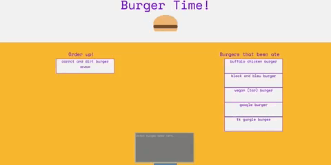
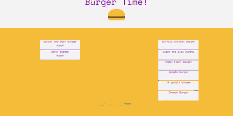

# Burger-Time!

## Description

This application is an example of a simple MVC Framework, with a NodeJS API that can handle get, put, and post requests. Users can view all burgers, create a new burger, and "eat the new burger".

### Create a new burger

### "Eat" a new burger

## Technologies

- NodeJS
- ExpressJS
- MVC Framework
- Handlebars
- MySql
- CSS

## Heroku:

https://powerful-dawn-28671.herokuapp.com/